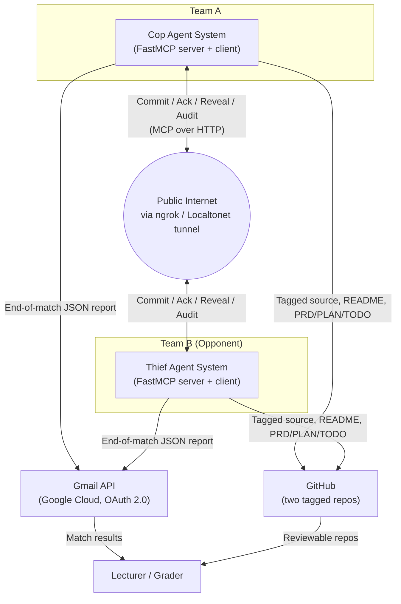
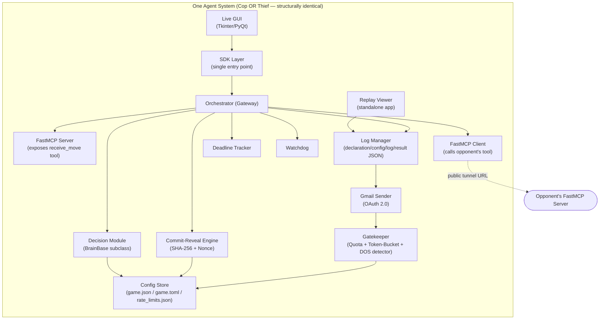
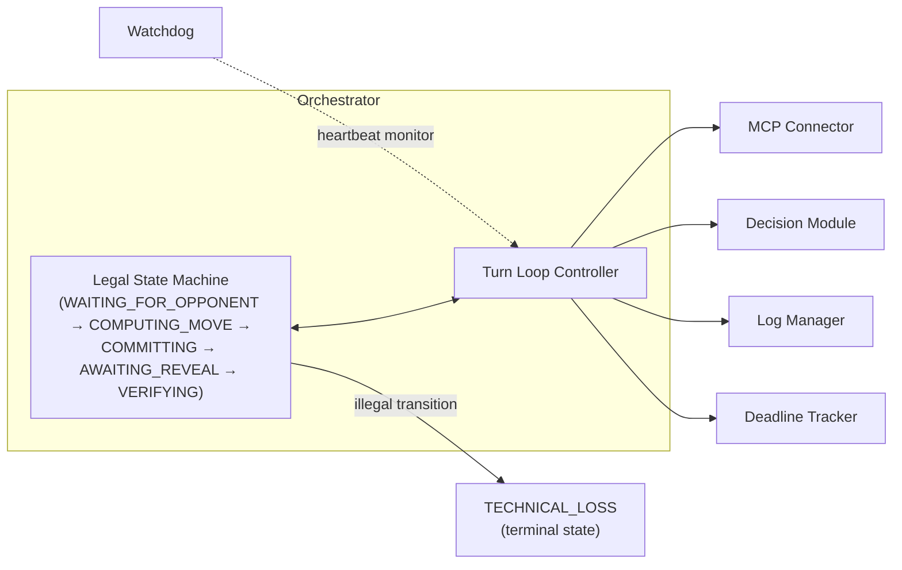
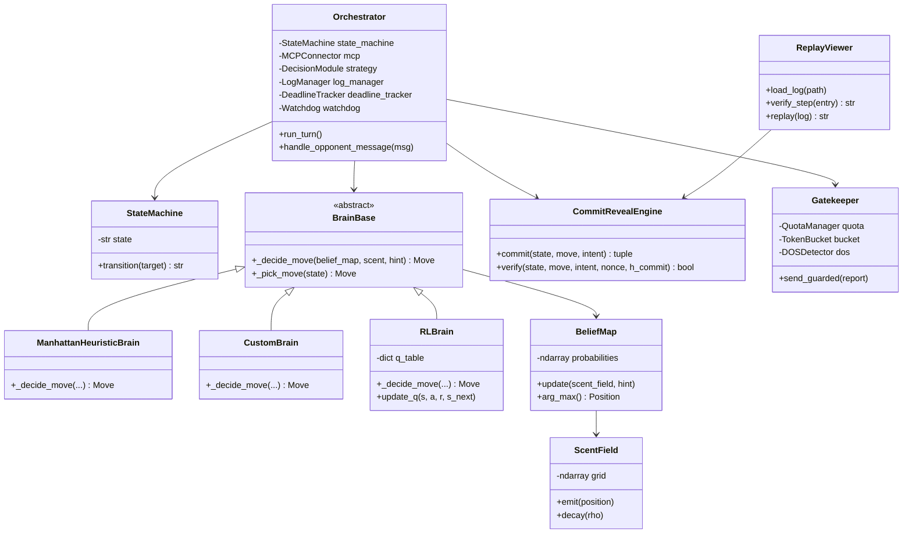
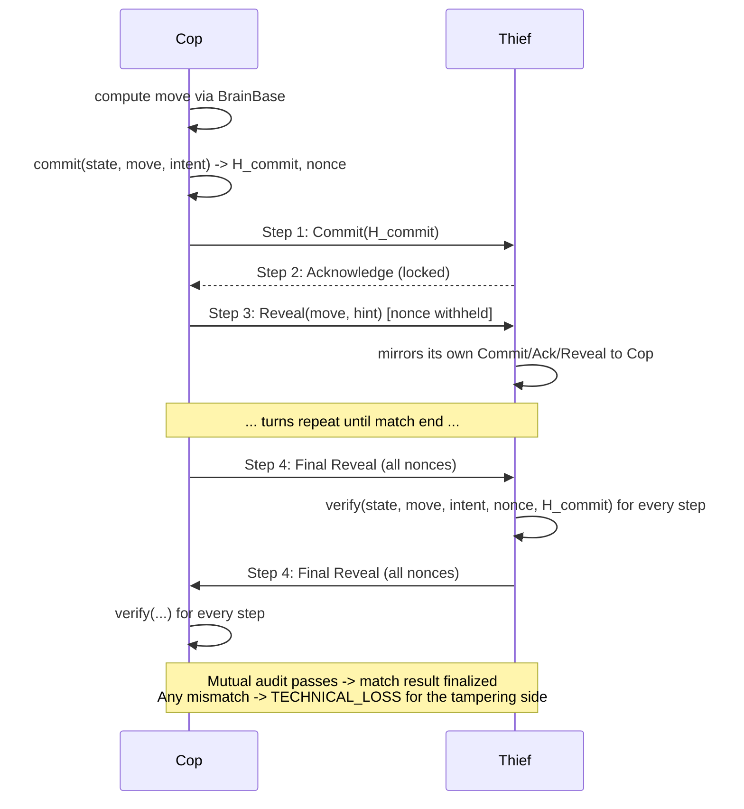
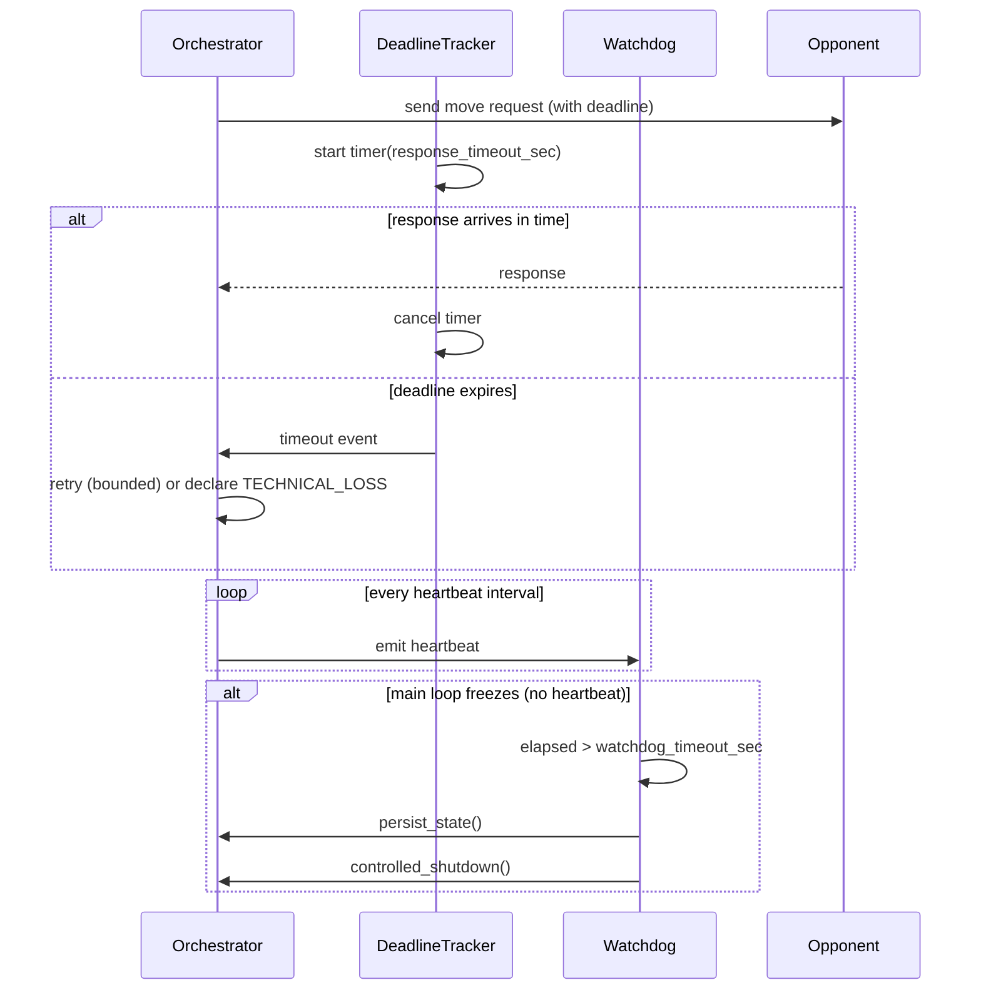
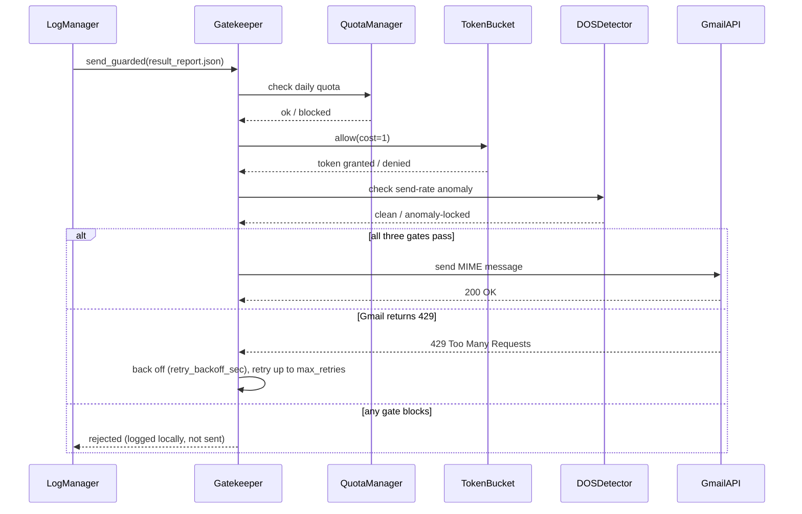
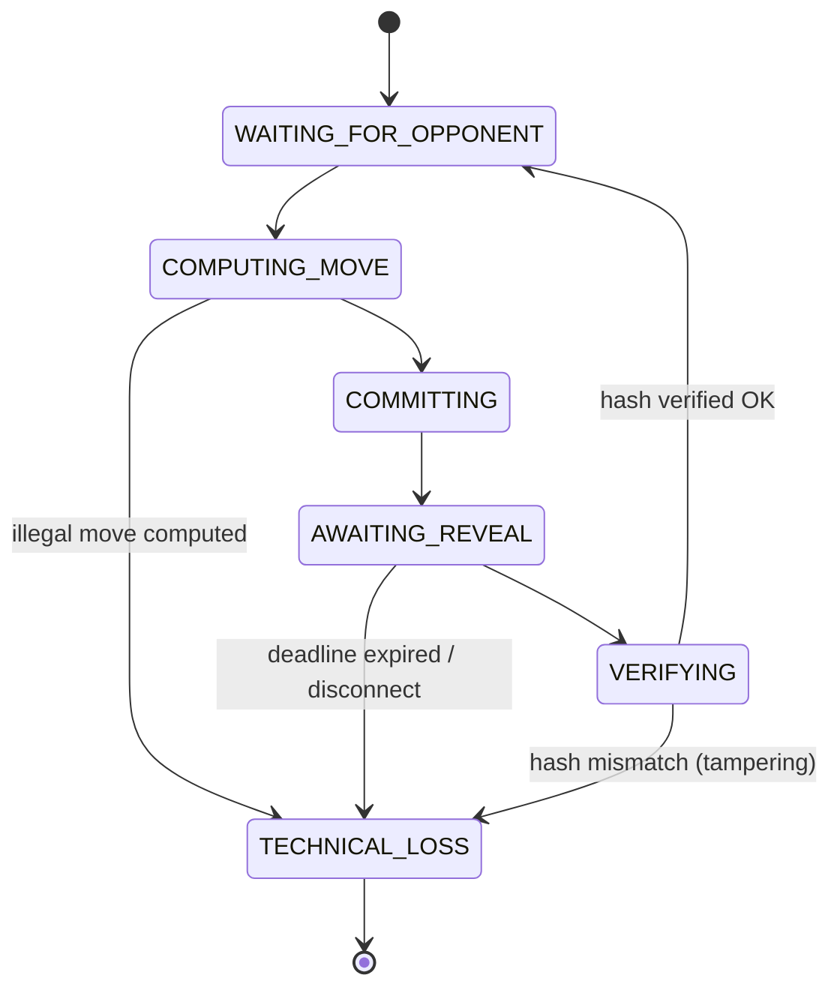
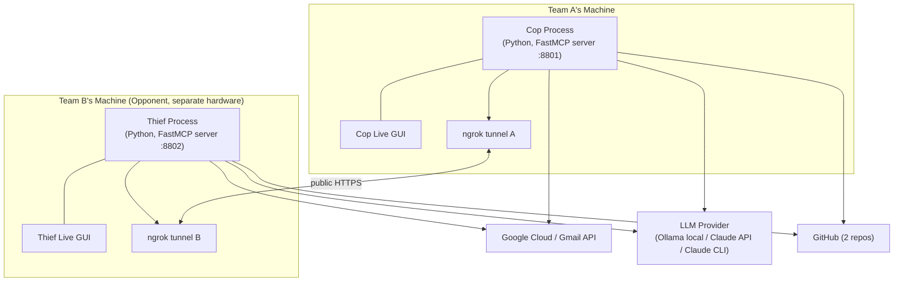

# Technical Plan & Architecture (PLAN)

**Project:** Distributed Cops-and-Robbers over a Peer-to-Peer Network
**Companion documents:** `docs/PRD.md` (goals/requirements/scope) · `docs/tasks.md` (full rulebook extraction) · `docs/TODO.md` (granular task checklist)
**Status:** Draft v1.0 — architecture proposal pending team approval before implementation proceeds

> Diagrams below use [Mermaid](https://mermaid.js.org/) syntax, which GitHub renders natively in Markdown. Every diagram is illustrative of the intended architecture; the binding numeric/behavioral requirements always live in `docs/tasks.md`.

---

## 1. Architectural Principles (non-negotiable, from both source documents)

1. **Zero-Trust process separation** — cop and thief are two independent OS processes/repos; no shared memory, no shared mutable object, ever (`docs/tasks.md` §3, rule 1–2).
2. **Single-gateway Orchestrator** — every sub-system (network, decision, logging, reliability) is reachable only through one Orchestrator; no module calls another module directly (`docs/tasks.md` §8).
3. **SDK-layer architecture** — all business logic is exposed through one SDK entry point consumed by GUI/CLI/Replay Viewer; no business logic lives in presentation layers (`software_submission_guidelines-V3.pdf` §4.1).
4. **Config-over-code** — every tunable value is loaded from `config/*.json`/`config/*.toml`, never hardcoded (`software_submission_guidelines-V3.pdf` §7.2; `docs/tasks.md` App. B).
5. **Cryptography closes every trust gap** — wherever two mutually-distrusting peers must agree on a fact (a move, a capture, a hardware spec), the fact is signed/hashed, never taken on the other side's word (`docs/tasks.md` §6).
6. **Fail loud, fail bounded, recover gracefully** — every network await has a deadline; every long-running process has a heartbeat watchdog; every illegal state transition is rejected immediately rather than silently tolerated (`docs/tasks.md` §8).
7. **Incremental, end-to-end layering** — each of the 7 build stages must work fully before the next is added; no layer is built "on faith" (`docs/tasks.md` §10; `docs/PRD.md` §6).

---

## 2. C4 Model — Level 1: System Context



**Reading it:** the Cop and Thief systems belong to two different, independently-developed teams and never share anything except what crosses the public internet through their tunnels. Both report independently and separately to the lecturer's Gmail address; both publish independently to GitHub. There is no box in this diagram representing "the game server," because none exists — this absence is the whole point of the architecture.

---

## 3. C4 Model — Level 2: Container Diagram (inside one agent system)



**Reading it:** the GUI and Replay Viewer are presentation-only — they call into the SDK/Log Manager and never contain game logic themselves. Everything funnels through the Orchestrator except read-only observability (GUI, Replay) and Gmail sending (which is deliberately gated by its own Gatekeeper, independent from the game's Orchestrator, since it is a separate reliability concern with its own failure modes — see §8 ADR-007).

---

## 4. C4 Model — Level 3: Component Diagram (inside the Orchestrator)



**Reading it:** the state machine is the authoritative gate — the Turn Loop Controller may only act within states the machine currently permits, and any attempt to skip a step (e.g., Reveal before Acknowledge) is rejected at this layer before it can propagate into a silent bug elsewhere.

---

## 5. C4 Model — Level 4: Code Diagram (key classes)



---

## 6. Sequence Diagram — One Full Turn (Commit-Reveal Handshake)



---

## 7. Sequence Diagram — Deadline Tracker & Watchdog Under Failure



---

## 8. Sequence Diagram — Gmail Reporting via the Gatekeeper



---

## 9. State Diagram — Legal Match State Machine



---

## 10. Deployment Diagram



**Key point:** `MachineA` and `MachineB` are never on the same LAN or trust domain in the general (live-league) case — the only path between them is two independently-restartable public tunnels. This is why the reliability layer (§7 above) is not optional polish; it is the primary defense against a very ordinary failure mode (a free-tier tunnel restarting mid-match).

---

## 11. Project & Package Structure

Per `software_submission_guidelines-V3.pdf` §2.4/§14, applied **independently to each of the two repos** (cop, thief) — they are structurally identical but never share code at runtime:

```
<repo-root>/                     # e.g. police-thief-cop/  or  police-thief-thief/
├── src/
│   └── police_thief/            # <package> — e.g. police_thief_cop / police_thief_thief
│       ├── __init__.py
│       ├── sdk/
│       │   └── sdk.py           # single entry point for ALL business logic
│       ├── domain/               # board, scent, belief, scoring, state machine, brains
│       │   ├── board.py
│       │   ├── scent.py
│       │   ├── belief.py
│       │   ├── scoring.py
│       │   ├── state_machine.py
│       │   └── strategy/
│       │       ├── brain_base.py
│       │       ├── heuristic_brain.py
│       │       └── rl_brain.py        # optional track
│       ├── services/             # orchestrator, mcp connectors, crypto, reporting
│       │   ├── orchestrator.py
│       │   ├── mcp_server.py
│       │   ├── mcp_client.py
│       │   ├── commit_reveal.py
│       │   ├── deadline_tracker.py
│       │   ├── watchdog.py
│       │   └── report_builder.py
│       ├── shared/
│       │   ├── gatekeeper.py     # API gatekeeper (rate limit / queue / retry)
│       │   ├── config.py         # configuration manager
│       │   ├── version.py        # version tracking (starts at 1.00)
│       │   └── constants.py
│       ├── infra/                # LLM providers, Gmail sending, tunneling glue
│       │   ├── llm_provider.py
│       │   └── gmail_sender.py
│       ├── gui/                  # Live GUI (Tkinter/PyQt) — presentation only, calls SDK
│       └── main.py
├── tests/
│   ├── unit/                     # mirrors src/ structure
│   └── integration/
├── docs/
│   ├── PRD.md                    # this project's master PRD (shared design, duplicated)
│   ├── PLAN.md                   # this file (shared design, duplicated)
│   ├── TODO.md
│   ├── PRD_board_physics.md
│   ├── PRD_fastmcp_networking.md
│   ├── PRD_strategy_module.md
│   ├── PRD_pheromone_scent.md
│   ├── PRD_commit_reveal_crypto.md
│   ├── PRD_reliability_layer.md
│   ├── PRD_gui_replay.md
│   └── PRD_gmail_gatekeeper.md
├── config/
│   ├── game.json                 # shared, signed, byte-identical constitution (App. B)
│   ├── game.toml                 # private per-peer settings (App. B)
│   ├── setup.json                # main app config (versioned)
│   └── rate_limits.json          # Gatekeeper rate-limit config (versioned)
├── data/                          # input data (if any, e.g. RL training data)
├── results/                       # match logs, declaration/config/log/result JSON
├── assets/                        # screenshots (heatmap GUI, Replay "Verified OK"), diagrams
├── notebooks/                     # results-analysis notebook (research/sensitivity analysis)
├── README.md                      # academic report (mandatory structure, see docs/tasks.md §9.4.6)
├── pyproject.toml                 # single source of truth for deps, ruff, coverage config
├── uv.lock
├── .env-example
└── .gitignore
```

**Rules enforced by this structure:**
- No file in `src/` exceeds 150 lines of code; when a module grows past this, split via helper extraction / mixin extraction / 50-50 read-write split / constants extraction (`software_submission_guidelines-V3.pdf` §3.2).
- All business logic is reachable only through `sdk/sdk.py`; `gui/` and any future CLI never contain game logic directly (§4.1 of the same guideline).
- `config/` files are the only source of tunable values; `constants.py` holds only true constants (physical/mathematical constants, enum values, parameter defaults) — never a substitute for config.
- `.env` (secrets) is git-ignored; `.env-example` (with dummy values) is committed instead.

---

## 12. Architecture Decision Records (ADRs)

### ADR-001: Adopt Dec-POMDP as the formal modeling framework
- **Context:** need a rigorous way to reason about two agents, partial observability, and stochastic transitions.
- **Decision:** model the game as a Dec-POMDP `⟨n, S, {Ai}, P, R, {Ωi}, O, γ⟩` (per `docs/tasks.md` §2).
- **Rationale:** this is the rulebook's own required framing (Ch.1) and gives us principled vocabulary for belief maps, discounting, and observation functions.
- **Alternatives considered:** treating it as a simple two-player zero-sum game tree (rejected — ignores partial observability and the deception channel); modeling as fully-observable MDP (rejected — contradicts the "no bird's-eye view" rule).
- **Status:** Accepted.

### ADR-002: FastMCP over raw sockets, gRPC, or A2A/ACP
- **Context:** need a P2P transport where each side is simultaneously server and client.
- **Decision:** use FastMCP exclusively, per the rulebook's mandatory requirement.
- **Rationale:** required by course rules; also handles tool schema/decorator ergonomics (`@mcp.tool`) well.
- **Alternatives considered:** A2A (Google) and ACP were reviewed as complementary/future protocols but are explicitly not required and add unnecessary complexity for this project's scope.
- **Status:** Accepted (mandatory, not really discretionary).

### ADR-003: Commit-Reveal + SHA-256 (not a blockchain or TLS-only trust model)
- **Context:** need tamper-evident move history with no central authority.
- **Decision:** 4-step Commit/Acknowledge/Reveal/Audit protocol using SHA-256 over canonical JSON, with a fresh cryptographic Nonce per commitment.
- **Rationale:** mandatory per rulebook; also the simplest correct primitive achieving the Zero-Knowledge-style guarantee needed (commitment without disclosure) without external infrastructure.
- **Alternatives considered:** a shared append-only ledger/blockchain (rejected — massive overkill, adds a new trust/infra dependency); TLS mutual-auth alone (rejected — proves identity, not move-commitment ordering).
- **Status:** Accepted.

### ADR-004: JSON for shared/signed config; TOML for private per-peer config
- **Context:** need both a byte-identical, hashable, cross-language contract and a human-readable local settings file.
- **Decision:** `config/game.json` (shared, signed) vs. `config/game.toml` (private, per-peer), per `docs/tasks.md` App. B.
- **Rationale:** JSON's canonical serialization supports reliable hashing across languages/implementations; TOML's comment support and readability suit a file humans edit locally and never exchange.
- **Alternatives considered:** YAML for everything (rejected — ambiguous canonicalization makes hashing fragile); single combined file (rejected — blurs the shared/private trust boundary).
- **Status:** Accepted.

### ADR-005: Single Orchestrator/Gateway, no direct module-to-module calls
- **Context:** need to prevent tight coupling between networking, decision-making, logging, and reliability code.
- **Decision:** all sub-systems are wired behind one `Orchestrator` object; no module imports another module directly.
- **Rationale:** matches both the rulebook's explicit architecture requirement (Ch.8) and the submission guideline's SDK-single-entry-point principle; makes swapping the Decision Module (e.g., heuristic → RL) a zero-impact change elsewhere.
- **Alternatives considered:** event bus/pub-sub (rejected as unnecessary complexity for a 2-party turn-based game); direct peer-to-peer module wiring (rejected — reproduces the "distributed monolith" anti-pattern and increases deadlock risk).
- **Status:** Accepted.

### ADR-006: LLM restricted to the verbal/deception layer only
- **Context:** LLMs are prone to coordinate/spatial hallucination.
- **Decision:** the LLM only ever produces/interprets natural-language hint text; the actual move is always computed by deterministic algorithmic code.
- **Rationale:** rulebook's one explicit "recommend, not forced" rule, but the risk (illegal move from a hallucinated coordinate → technical loss) makes it a de facto hard boundary for us; deviating would require documented mutual agreement with every opponent team, which is not planned.
- **Alternatives considered:** LLM-assisted move scoring as a secondary signal feeding the heuristic (deferred — possible future extension, not in v1 scope).
- **Status:** Accepted.

### ADR-007: Independent Gatekeeper for Gmail reporting (separate from game Orchestrator)
- **Context:** Gmail API has its own failure modes (429 rate limiting, quota, account lockout) unrelated to game-turn networking.
- **Decision:** a dedicated `Gatekeeper` (Quota Manager + Token-Bucket + DOS Detector) sits only in front of outbound Gmail calls, decoupled from the per-turn MCP Deadline Tracker/Watchdog.
- **Rationale:** these are different failure domains with different recovery strategies (backoff-and-retry vs. timeout-and-technical-loss); conflating them would make both harder to reason about and test.
- **Alternatives considered:** reusing the same Deadline Tracker for both (rejected — Gmail failures should never cause a game technical loss).
- **Status:** Accepted.

### ADR-008: ngrok as primary tunnel, Localtonet as fallback
- **Context:** need public reachability from behind NAT/firewalls.
- **Decision:** default to `ngrok`; document and test `Localtonet` as a fallback.
- **Rationale:** ngrok has the most mature free-tier developer tooling and documentation; having a second option mitigates single-vendor outage risk during a scheduled league match.
- **Alternatives considered:** self-hosted reverse proxy on a VPS (rejected — unnecessary infrastructure cost/complexity for course scope).
- **Status:** Accepted.

### ADR-009: Flat JSON log files, not a database
- **Context:** need to persist declaration/config/log/result data per match.
- **Decision:** four namespaced JSON files per match (`declaration_<game_id>.json`, etc.), no database.
- **Rationale:** matches the rulebook's mandated file-based reporting model exactly; keeps the Replay Viewer's dependency footprint minimal (no DB driver needed to grade the project).
- **Alternatives considered:** SQLite for match history (rejected — adds a dependency with no requirement driving it; flat files are also easier for the lecturer to inspect directly).
- **Status:** Accepted.

### ADR-010: Strategy track selection (heuristic vs. custom vs. optional RL)
- **Context:** rulebook explicitly presents three algorithmically-equal tracks; team must choose at least a baseline and may add more.
- **Decision:** **pending team sign-off** (see `docs/PRD.md` §8, Open Questions). Baseline plan: implement the Manhattan-distance heuristic + Bayesian belief map first (Stage 3/4, required regardless of later choices, since it is also the fallback/regression baseline); layer in a custom algorithm and/or RL track afterward only if time budget allows, per the "stretch goal" classification in `docs/TODO.md` §S.2.
- **Rationale:** the heuristic track is the fastest to reach a working Stage-3/4 milestone and provides a regression baseline for comparing any later, more ambitious track.
- **Alternatives considered:** starting directly with RL (rejected as first choice — higher risk of missing Stage-3/4 milestones before training converges).
- **Status:** Proposed — pending approval.

### ADR-011: Single shared package during development, split into two repos at submission
- **Context:** the rulebook mandates cop and thief run as fully separate processes with no shared memory, and mandates two separate GitHub repos at submission time (`docs/tasks.md` §3, §9 rule 49). §11 of this plan originally proposed building two independently-duplicated repo trees from the very first commit.
- **Decision:** build **one shared package** (`police_thief`) during development, with the two roles differentiated at runtime by a `--role cop`/`--role thief` CLI flag and by loading separate `config/police/`/`config/thief/` directories. Two OS processes running this same on-disk package never share memory — each gets its own interpreter and heap — so the "no shared runtime state" rule is satisfied without needing two copies of the source tree. The literal two-GitHub-repos deliverable is produced later, at submission time (`docs/TODO.md` §O), by exporting this single codebase into two tagged repos.
- **Rationale:** avoids maintaining two duplicated, drifting copies of shared/generic code (Dec-POMDP scaffolding, board physics, crypto protocol, reliability layer) throughout active development, when the actual rule being protected (no shared *runtime* state) does not require separate *source trees*, only separate *processes*. This also matches how the rulebook's own example repo works (`docs/tasks.md` App. D): one repo, two independently-runnable peers.
- **Alternatives considered:** maintaining two fully separate repos from commit #1 (rejected for this team's development phase — meaningfully more merge/sync overhead with no corresponding rule benefit; still fully achievable at submission time via a straightforward export/split).
- **Status:** Accepted (supersedes the two-repo-from-day-one framing implicit in the original §11 structure; §11's per-repo layout still describes the target shape each exported repo will have at submission time).

---

## 13. API & Data Contracts

### 13.1 MCP Tool Contract (per agent, symmetric)
```
tool: receive_move
input:  { "signed_move": <str, canonical JSON envelope>, "signature": <str, hex> }
output: { "accepted": <bool>, "move": <str | null> }
```
Full four-step protocol envelope fields (see `docs/PLAN.md` §6 sequence diagram and `docs/tasks.md` §6):
`H_commit` (Step 1) → acknowledgment (Step 2, no payload beyond confirmation) → `{move, hint, intent}` (Step 3, nonce withheld) → `{nonce}` for every prior step (Step 4, end of match only).

### 13.2 Shared Signed Config — `config/game.json`
Schema and full example reproduced in `docs/tasks.md` §13.3. Top-level sections: `schema_version`, `agreed_between`, `board_and_agents`, `world`, `movement_and_barriers`, `scoring`, `pheromones`, `network_and_league`, `rate_limiter_gatekeeper`.

### 13.3 Private Per-Peer Config — `config/game.toml`
Schema and full example reproduced in `docs/tasks.md` §13.4. Sections: `[game]`, `[network]`, `[strategy]`, `[trash_talk]`, `[llm]`, `[email]`.

### 13.4 Match Lifecycle JSON Files
| File | Schema owner | Consumed by |
|---|---|---|
| `declaration_<game_id>.json` | Step-0 fairness module | Opponent (pre-match), Replay Viewer, lecturer |
| `config_<game_id>_g<NN>.json` | Config loader | Opponent (pre-match), Replay Viewer |
| `log_<game_id>_g<NN>.json` | Log Manager | Replay Viewer, mutual audit routine |
| `result_<game_id>.json` | Report Builder | Gmail (lecturer), league scoring |

Full field-level schemas are defined in `docs/tasks.md` §9.3.16-21 and Appendix F Table 20; this plan document does not duplicate them, only references their consumers/producers.

### 13.5 Rate-Limit Config — `config/rate_limits.json`
Per `software_submission_guidelines-V3.pdf` §5.2, versioned, structured as:
```json
{
  "rate_limits": {
    "version": "1.00",
    "services": {
      "default": {
        "requests_per_minute": 30,
        "requests_per_hour": 500,
        "concurrent_max": 5,
        "retry_after_seconds": 30,
        "max_retries": 3
      }
    }
  }
}
```
(Reconciled with the game-specific Gatekeeper values in `docs/tasks.md` Table 19 — the stricter/more specific of the two value sets applies where they overlap.)

---

## 14. Engineering Plan — Test-Driven Development & Quality Gates

Per `software_submission_guidelines-V3.pdf` §6, applied to every module in the package structure (§11 above):

1. **Red** — write a failing unit test for the next smallest unit of behavior before writing the implementation.
2. **Green** — write the minimum code to pass that test.
3. **Refactor** — clean up (extract helpers/mixins, enforce ≤150 LOC/file, apply DRY) while keeping tests green.
4. **Coverage gate**: `pytest --cov`, `fail_under = 85` enforced in `pyproject.toml`.
5. **Lint gate**: `ruff check` must report zero violations before any commit is considered mergeable.
6. **Mocking policy**: external dependencies (Gmail API, LLM providers, opponent network calls) are mocked in unit tests; real end-to-end integration tests (TODO §M.2) exercise the genuine dependencies separately and are not part of the 85% unit-coverage gate.
7. **Adversarial/red-team pass**: dedicated tests attempt to break our own integrity guarantees (false capture claims, tampered logs, replayed nonces) — see TODO §M.3.

---

## 15. Risk Register

| Risk | Likelihood | Impact | Mitigation |
|---|---|---|---|
| Free-tier tunnel (ngrok) drops or rotates mid-match | Medium | High (match interrupted) | Deadline Tracker + Watchdog + documented Localtonet fallback (ADR-008) |
| LLM provider outage or rate limit during verbal-layer generation | Medium | Low (cosmetic only, since moves are algorithmic) | Automatic fallback to zero-token `template` provider |
| Gmail API `429` during high-volume league play | Low-Medium | Medium (missed report = no score credit) | Gatekeeper: Quota Manager + Token-Bucket + backoff (ADR-007) |
| Opposing team's config negotiation diverges from ours (byte mismatch) | Medium | High (match cannot start) | `config_sha256` comparison gate before Step-0 proceeds |
| Nonce reuse or weak randomness bug | Low | Critical (breaks cryptographic guarantee) | Use `secrets` module exclusively, never `random`; dedicated unit tests (TODO §H.1) |
| File exceeds 150-LOC limit as features accumulate | High (organic growth) | Low (quality-gate violation only) | Continuous refactor discipline; §3.2 splitting strategies applied proactively |
| Team member unavailable near deadline | Medium | High | Shared understanding requirement (TODO §S.3) — both teammates must be able to run/debug the full pipeline independently |
| Opponent team plays in bad faith (false game-count declaration, hidden barrier, etc.) | Low-Medium | Medium (unfair scoring if undetected) | Mutual audit + cryptographic proof design makes most bad-faith actions detectable and disqualifying by construction |
| Board/physics state space grows too large if `grid_size` is increased by agreement | Low | Medium (performance) | Belief-map and heuristic computations profiled (TODO §M.4); minimums in Mandatory Parameters Table are floors, and increases should be re-profiled before being accepted |

---

## 16. What This Plan Deliberately Does Not Cover

Per `docs/PRD.md` §5.4 (Out of Scope): this plan does not design a generic pluggable transport layer, a database-backed match history, an A2A/ACP integration, or a production-grade cloud deployment pipeline (CI/CD beyond local lint/test hooks). These are explicitly excluded to keep the plan proportionate to a two-person, single-course-term academic project.

**Approval:** this plan should be reviewed jointly by both team members, cross-checked against `docs/PRD.md`'s open questions (§8 there), and only then should the per-mechanism `docs/PRD_<mechanism>.md` documents (§7 of `docs/PRD.md`) be written and implementation begin in earnest, per the mandatory workflow order in `software_submission_guidelines-V3.pdf` §2.5.
